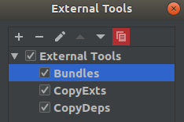

Configure Rider
****************

.. note::

   This page is for Rider 2018.2 and upper.

| Rider doesn't use all ``.sln`` tag to build your application.
| In this page, we show to configure Rider to build bundles before build the application.

Create an external tool
=======================

Click on edit configuration

.. image:: ../_static/images/screen1.png
   :alt: open configuration

If you have already one configuration, click on it

| And click the plus sign in section Before launch (number 2 on picture).
| In popup menu, select external tool

In new window click on plus sign:

.. image:: ../_static/images/screen4.png

Now, in external tool configuration window:

1. enter a name for your new external tool configuration.
2. in program field, enter same text as screen shot. Help yourself with macros.
3. in arguments field enter bundles.
4. working directory is auto completed.
5. click on save.

Once you've configured this external tool, copy it and create the two other ones:

Change argument field to ``copyexts`` for the second external tool and ``copydeps`` for the third external tool.
Be sure you have the external tools and the project build tasks in this order:

Create an file watcher for javascript minification
==================================================

In this example, we use Uglifyjs. You can install with nodejs by ``npm install uglify-js -g``.

| Goto Settings (:kbd:`Ctrl` + :kbd:`Alt` + :kbd:`S`), section Tools -> File Watchers

| In right of window, click on + sign (or :kbd:`Ctrl` + :kbd:`n`) to add a new file watcher.
| Select Uglify in list and give a name to your new file watcher.

In Edit Watcher window, click on three dot of Scope field.

In Scope window, select your javascript file and click to add.

Finish by clicking on Ok. Close all settings windows.