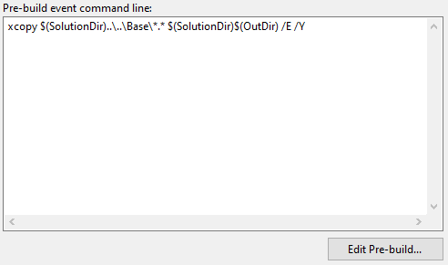

Using Base as dependency
************************

Configure a new project with Visual Studio 2017/2019
====================================================

Create new solution with classlib project targeted in NET. Core 2.2.

.. image:: ../_static/images/SampleExtensionConfig1.png
   :alt: sample extension configuration application tab

Add reference to Base and ExtCore (ExtCore is dependecy of Base)

.. image:: ../_static/images/SampleExtensiondeps1.png
   :alt: dependencies of sample application

Configure pre-build scripts
---------------------------
Before build, you need to copy all Base dependencies to `$(SolutionDir)$(OutDir)` folder:

Configure post-build scripts
----------------------------
After build, you need to copy your extension into base extension folder:

.. image:: ../_static/images/SampleExtensionPostBuild.png
   :alt: post build tab configuration

Configure debug tab
-------------------
Must important, configure debugging.
You extension as a partial app and it's not directly executed. Here how to configure your application to make possibility of debugging.

.. image:: ../_static/images/SampleExtensionDebugTabApp.png
   :alt: debug tab configuration

Now, you can debbug you extension into Visual Studio.

With commande line and visaul Studio Code
====================================================

Create a new project:

.. code-block:: bash

   $ dotnet new classlib -o <your_new_project> -f netcoreapp2.2

Open new csproj file and **adapt with highlighted lines** this example:

.. code-block:: xml
  :linenos:
  :emphasize-lines: 20,27,28,29,30,31,32

    <Project Sdk="Microsoft.NET.Sdk.Web">

        <PropertyGroup>
            <TargetFramework>netcoreapp2.2</TargetFramework>
            <AspNetCoreHostingModel>InProcess</AspNetCoreHostingModel>
            <ApplicationIcon />
            <OutputType>Library</OutputType>
            <StartupObject />
        </PropertyGroup>

        <PropertyGroup Condition="'$(Configuration)|$(Platform)'=='Debug|AnyCPU'">
            <NoWarn>1701;1702;1591</NoWarn>
        </PropertyGroup>

        <ItemGroup>
            <EmbeddedResource Include="Styles\**;Scripts\**\*.min.js;Views\**" />
        </ItemGroup>

        <ItemGroup>
            <PackageReference Include="ExtCore.Infrastructure" Version="4.1.0" />
            <PackageReference Include="Microsoft.AspNetCore.App" />
            <PackageReference Include="Microsoft.AspNetCore.Razor.Design" Version="2.2.0" PrivateAssets="All" />
            <PackageReference Include="Swashbuckle.AspNetCore" Version="4.0.1" />
        </ItemGroup>

        <ItemGroup>
            <Reference Include="SoftinuxBase.Infrastructure, Version=0.0.1.0, Culture=neutral, PublicKeyToken=null">
            <HintPath>..\..\Base\SoftinuxBase.Infrastructure.dll</HintPath>
            </Reference>
            <Reference Include="SoftinuxBase.Security.Common, Version=0.0.1.0, Culture=neutral, PublicKeyToken=null">
            <HintPath>..\..\Base\SoftinuxBase.Security.Common.dll</HintPath>
            </Reference>
        </ItemGroup>

        <Target Name="PreBuild" BeforeTargets="PreBuildEvent">
            <Exec Command="xcopy $(SolutionDir)..\..\Base\*.* $(SolutionDir)$(OutDir) /E /Y" />
        </Target>

        <Target Name="PostBuild" AfterTargets="PostBuildEvent">
            <Exec Command="mkdir $(SolutionDir)$(OutDir)Extensions&#xD;&#xA;copy $(SolutionDir)$(OutDir)SampleApi.dll $(SolutionDir)$(OutDir)Extensions /Y&#xD;&#xA;copy $(SolutionDir)$(OutDir)SampleApi.xml $(SolutionDir)$(OutDir)Extensions /Y" />
        </Target>

    </Project>
.. note ::
    Path in `<HintPath>` are given as esamples.

