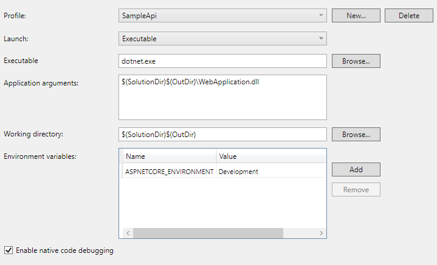

Configure a new project with Visual Studio 2017/2019
****************************************************

Create new solution with a new ASP.NET Core project targeted on framework .NET Core 2.2.

Creation in Visual Studio 2019
-------------------------------

Creation in Visual Studio 2017
-------------------------------

Verification
------------
Check if your new project is targeted on framework .NET Core 2.2.

.. figure:: ../../_static/images/SampleExtensionConfig1.png
   :alt: sample extension configuration application tab

   Project properties, Application tab.

Add references
--------------

Add references to Base and ExtCore (ExtCore is dependency of Base)

.. figure:: ../../_static/images/SampleExtensiondeps1.png
   :alt: dependencies of sample application

Configure pre-build scripts
---------------------------
Before build, you need to copy all Base dependencies to `$(SolutionDir)$(OutDir)` folder:

.. image:: ../../_static/images/SampleExtensionPreBuild.png
   :alt: pre build tab configuration

Configure post-build scripts
----------------------------
After build, you need to copy your extension into base extension folder:

Configure debug tab
-------------------
Must important, configure debugging.
You extension as a partial app and it's not directly executed. Here how to configure your application to make possibility of debugging.

Now, you can debbug you extension into Visual Studio.

